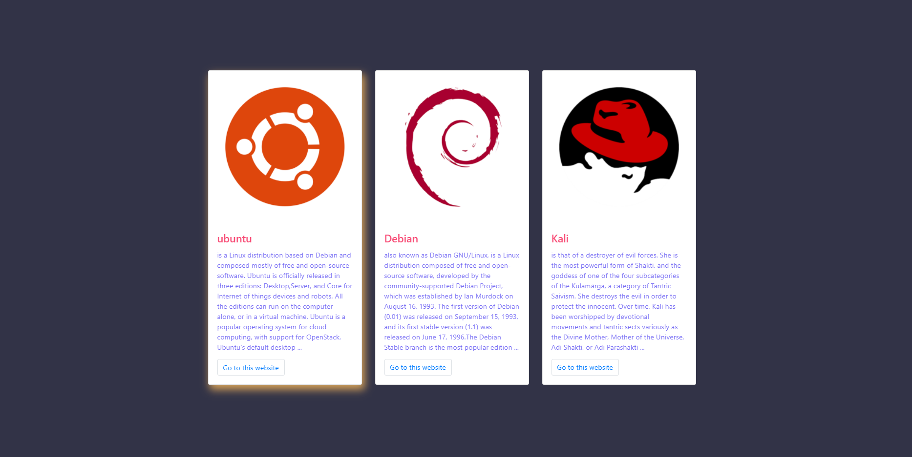

# React App Codebase - BootStrap - Card

### Install
    npm i

    npm start

### `Topic Knowledge`
- React functional
- Bootstrap-React
- Bootstrap - card 
- CSS style
- pass value between component with props
- animate css & hover transition, transform style

### Boostrap - Card
    CSS Gradient: https://cssgradient.io/
    animate CSS: https://animate.style/

